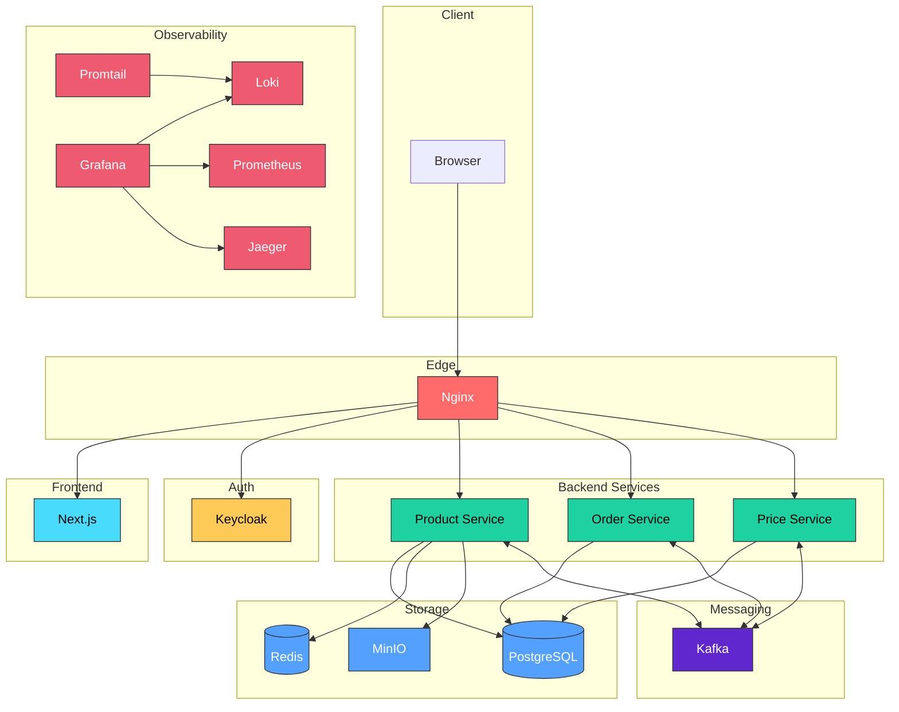

# OzonMarketplace
## О проекте
## Описание
Проект представляет собой упрощенную модель маркетплейса. Построен на микросервисной архитектуре с .NET. Клиентская часть реализована на Next.js
### Технологический стек
#### Backend
| Технология           | Версия | Назначение                 |
| -------------------- | ------ | -------------------------- |
| **.NET**             | 10.0   | Runtime для микросервисов  |
| **Dapper**           | 2.1.79 | Micro-ORM для read-queries |
| **FluentMigrator**   | 8.0.1  | Миграции к БД              |
| **FluentValidation** | 12.1.1 | Валидация запросов         |
| **OpenTelemetry**    | 1.16.0 | Distributed tracing        |
| **DotNetCore.CAP**   | 10.0.1 | Общение с Kafka            |
#### Frontend
| Технология        | Версия | Назначение            |
| ----------------- | ------ | --------------------- |
| **Next.js**       | 16     | React framework с SSR |
| **TypeScript**    | 5      | Type safety           |
| **Tailwind CSS**  | Latest | Utility-first CSS     |
| **Vite.js (HMR)** |        |                       |
#### Infrastructure

| Технология       | Назначение                   |
| ---------------- | ---------------------------- |
| **Nginx**        | Reverse proxy                |
| **PostgreSQL**   | Основная бд                  |
| **Redis**        | Кэш запросов                 |
| **Apache Kafka** | event streaming              |
| **MinIO**        | S3-compatible object storage |
| **Keycloak**     | Identity provider            |
#### Observability

| Технология     | Назначение       |
| -------------- | ---------------- |
| **Prometheus** | Хранилище метрик |
| **Grafana**    | dashboards       |
| **Loki**       | Хранилище логов  |
| **Jaeger**     | трейсинг         |
| **Promtail**   | сбор логов       |

## Архитектура
### Верхнеуровневая

### Сервис заказов

```mermaid
flowchart TB

    subgraph Presentation["Presentation Layer<br/>OrderService.Http"]
        Controllers["Controllers"]
        DTOs["DTOs / Requests / Responses"]
        Middleware["Middleware<br/>ExceptionHandler"]
        Filters["Filters / Validators"]
    end

    subgraph UseCases["Application Layer (UseCases)<br/>Оркестрация без бизнес-логики"]
        direction TB
        subgraph Commands["Commands (Write)"]
            CmdHandlers["Command Handlers"]
            CmdValidators["Validators"]
            CmdPipelines["Pipeline Behaviors<br/>(Validation, Logging)"]
        end
        subgraph Queries["Queries (Read)"]
            QryHandlers["Query Handlers"]
            QryModels["Read Models"]
        end
    end

    subgraph Domain["Domain Layer<br/>OrderService.Domain"]
        Entities["Entities"]        
        Repositories["Repository Interfaces"]
        ValueObjects["Value Objects<br/>(Money, Address, OrderStatus)"]
        DomainEvents["Domain Events<br/>(OrderCreated, OrderCancelled)"]
        
    end

    subgraph Infrastructure["Infrastructure Layer"]
        direction TB
        subgraph Persistence["OrderService.Infrastructure.Persistence"]
            Dapper
            RepoImpl["Repository Implementations"]
            Migrations["Migrations"]
            UoW["Unit of Work"]
        end
        subgraph EventBusImpl["OrderService.Infrastructure.EventBus"]
            Kafka["Kafka Producer"]
            EventDispatcher["Domain Event Dispatcher"]
            Outbox["Outbox Pattern"]
        end
    end

    subgraph External["External"]
        PostgreSQL[("PostgreSQL")]
        Kafka2["Apache Kafka"]
        ProductService["Product Service"]
        PriceService["Price Service"]
    end

    %% Dependencies (стрелки внутрь по Dependency Rule)
    Controllers --> CmdHandlers
    Controllers --> QryHandlers
    
    CmdHandlers --> Repositories
    
    QryHandlers --> Repositories
    
    RepoImpl --> Dapper
    Dapper --> PostgreSQL
    
    EventDispatcher --> Kafka
    Kafka --> Kafka2
    
    Kafka2 -.-> ProductService
    Kafka2 -.-> PriceService

    %% Styling
    classDef presentation fill:#48dbfb,stroke:#333,color:#000
    classDef usecases fill:#1dd1a1,stroke:#333,color:#000
    classDef domain fill:#feca57,stroke:#333,color:#000
    classDef infra fill:#ff6b6b,stroke:#333,color:#fff
    classDef external fill:#54a0ff,stroke:#333,color:#fff
    
    class Controllers,DTOs,Middleware,Filters,Mappers presentation
    class CmdHandlers,CmdValidators,CmdPipelines,QryHandlers,QryModels usecases
    class Aggregates,Entities,ValueObjects,DomainEvents,DomainServices,Exceptions,Repositories,EventBus domain
    class Dapper,RepoImpl,Migrations,UoW,Kafka,EventDispatcher,Outbox infra
    class PostgreSQL,Kafka2,ProductService,PriceService external
```


### Сервис товаров


##  Структура бэкенда

```
backend
├── OrderService
│   ├── OrderService.Domain                         
│   ├── OrderService.Http
│   ├── OrderService.Infrastructure.EventBus
│   ├── OrderService.Infrastructure.Persistence
│   ├── OrderService.UseCases.Commands
│   └── OrderService.UseCases.Queries
├── ProductService
│   ├── Dockerfile
│   ├── ProductService.Application
│   ├── ProductService.Domain
│   ├── ProductService.Infrastructure
│   ├── ProductService.Infrastructure.Abstractions
│   └── ProductService.Presentation
├── Redis                                           # Общий сервис для Redis (dev)
│   ├── Provider
│   └── Service
└── S3                                              # Общий сервис для Minio (dev)
    └── Minio
```
## Запуск
В infrastructure лежат настройки для yandex cloud VM, которая работает за api-gateway, поэтому для локального запуска нужно использовать infrastructure-dev
Требуется docker compose и Node.js 20+
1. Настройка окружения
	Скопировать .env.example из корня репозитория в infrastructure-dev
2. Запуск инфраструктуры
	Запустить infrastructure-dev/docker-compose.yml
	```
	cd infrastructure-dev
	docker compose up -d
	``` 
3. Доступ к сервисам

| Сервис             | URL                                | Credentials             |
| ------------------ | ---------------------------------- | ----------------------- |
| **Frontend**       | http://localhost:3000              |                         |
| **Keycloak Admin** | http://localhost:8080              | admin / admin123        |
| **Product API**    | http://localhost:5001/api/products | JWT                     |
| **Order API**      | http://localhost:5002/api/orders   | JWT                     |
| **Grafana**        | http://localhost:3200              | admin / admin           |
| **Kafka UI**       | http://localhost:8082              |                         |
| **MinIO Console**  | http://localhost:9001              | minioadmin / minioadmin |
| **Jaeger UI**      | http://localhost:16686             |                         |
4. Тестовые пользватели
	- **Customer**: `test@example.com` / `password`
	- **Admin**: `admin@example.com` / `admin123`
5. Речное получение токена
	```
	curl.exe -X POST "http://localhost:8080/realms/marketplace/protocol/openid-connect/token" -H "Content-Type: application/x-www-form-urlencoded" -d "grant_type=password" -d "client_id=marketplace-app" -d "username=<username>" -d "password=<password>" -d "scope=openid"
	```
##  Деплой
Деплой производился на yandex cloud, с разворачиванием docker-compose.yml на виртуальной машине за api-gateway. 

### Проблемы с Keycloak
Keycloak жестко требует https при не локальном запуске, поэтому необходимо ставить ВМ за api-gateway, который предоставит https, без этого нужно было бы вручную поднимать домен.
