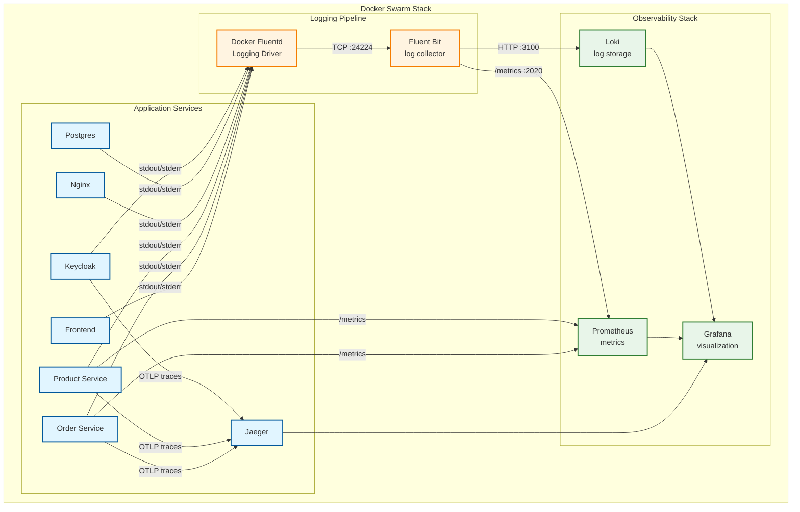

# Обзор

| Ограничение                         | Влияние на логирование                                   |
| ----------------------------------- | -------------------------------------------------------- |
| **Отсутствие root-прав**            | Невозможно использовать Promtail (требует `docker.sock`) |
| **Portainer блокирует bind-mounts** | Нельзя монтировать `/var/log` или локальные конфиги      |
| **Docker Swarm**                    | ограничения, overlay-сети изолированы от хоста           |
# Архитектура

## Компоненты системы
1. Fluent Bit (Log Collector)
	Не требует root
	Роль: Принимает логи от Docker logging driver
2. Docker Fluentd Logging Driver
	Встроенный драйвер Docker, который перенаправляет `stdout`/`stderr` контейнеров на внешний Fluentd
3. Loki
	Роль: Хранилище логов
4. Grafana
	Роль: dashboard
5. Prometheus
	Роль: Хранилище метрик
6. Jaeger
	Роль: трейсинг

# Интеграция в сервисы
## Сторонние сервисы (без OTEL)
**Сервисы**: PostgreSQL, Redis, MinIO, Nginx, Jaeger, Kafka UI, pgAdmin
**Решение**: Docker Fluentd logging driver - Fluent Bit
- Пишут логи в stdout/stderr
- Docker сам перенаправляет логи в Fluent Bit
## с OTEL
**Сервисы**: Keycloak
- **OTLP** для трейсинга - Jaeger
- **Fluentd driver** для application-логов - Fluent Bit - Loki
## Init-контейнеры
**Сервисы:** `keycloak-init`, `grafana-init`
- Init-контейнеры выполняются один раз и завершаются
- Логи важны для отладки
- Пишут без OTEL 
## .NET
**Сервисы**: бэкенд
- Можно вркчную настроить AddOpenTelemetry().AddOtlpExporter()
- либо писать напрямую без OTEL

